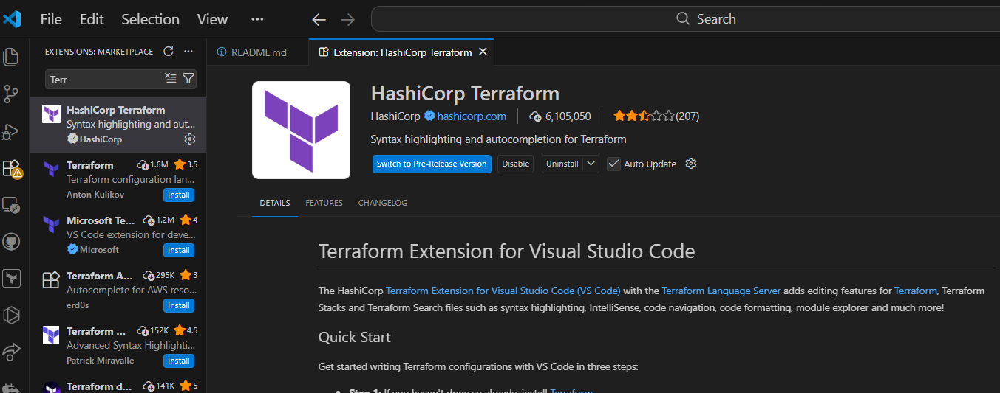

## 🚀 DevOps Environment Setup -- Terraform & AWS

This repository documents my Day 1 progress in setting up a complete
DevOps environment for learning Infrastructure as Code (IaC) using
Terraform and AWS.

It includes installation reports, configuration steps, and supporting
diagrams to provide a clear, reproducible setup process.

### 📌 Overview

The goal of this project is to:

- Set up Terraform locally

- Install and configure AWS CLI

- Prepare a development environment using VS Code

- Understand the basics of Infrastructure as Code (IaC)


### 🛠️ Tools & Technologies

- Terraform

- Amazon Web Services (AWS CLI)

- Visual Studio Code

- Git Bash

## 📂 Project Structure
DevOps-Setup/
│ ├── README.md 
├── Reports/ │ ├──
Terraform_Installation.md │ ├── AWS_CLI_Installation.md │ └──
VSCode_Setup.md │ ├── Diagrams/ │ └── terraform_iac.png │ └── Scripts/
└── example.tf

### ⚙️ Setup Summary

1. Terraform Installation

- Downloaded Terraform (Windows AMD64)

- Extracted and stored in C:`\terraform`{=tex}

- Added to system PATH

- Resolved Git Bash PATH issue via .bashrc


2.  AWS CLI Setup

- Installed using MSI installer

- Verified with:

```bash
aws --version
```

- Configured credentials and verified using:

```bash
aws sts get-caller-identity 3. VS Code Configuration
```

### Installed extensions in vscode:

- HashiCorp Terraform


- AWS Toolkit
![AWS Toolkit] (images/aws_tookit.png)


### ⚠️ Challenges & Solutions Issue: Terraform not recognized in Git Bash

**Cause:** Git Bash not inheriting Windows PATH

**Solution:**

```bash
echo 'export PATH=\$PATH:/c/terraform' \>\> \~/.bashrc source \~/.bashrc
```

### 🧠 Key Learnings

Understanding how Infrastructure as Code (IaC) works

Importance of environment variables (PATH)

Differences between Windows shell and Git Bash

Setting up a reproducible DevOps workflow


### 🤝 Acknowledgment

This work is part of the 30-Day Terraform Challenge, learning alongside:

- AWS AI/ML UserGroup Kenya

- Meru HashiCorp User Group

- EveOps Community


### 📬 Connect

Feel free to follow my journey and connect with me as I continue
learning and building in DevOps and Cloud Engineering.
